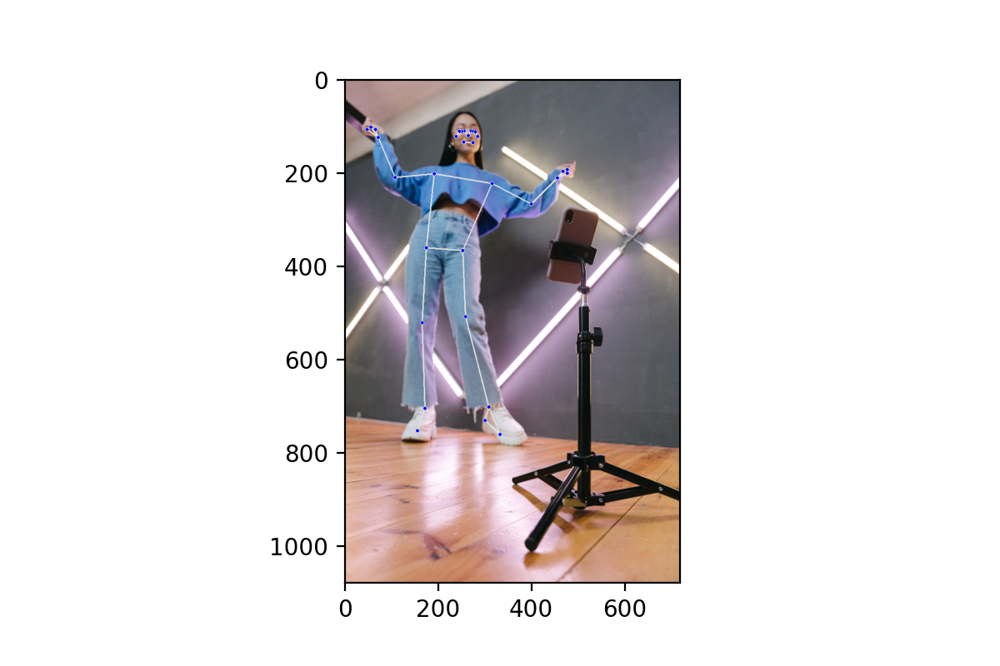
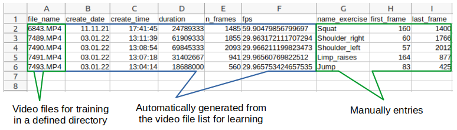
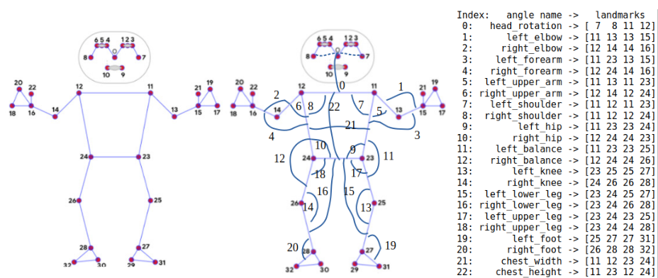
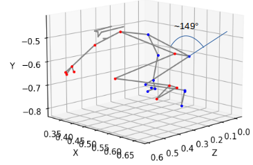
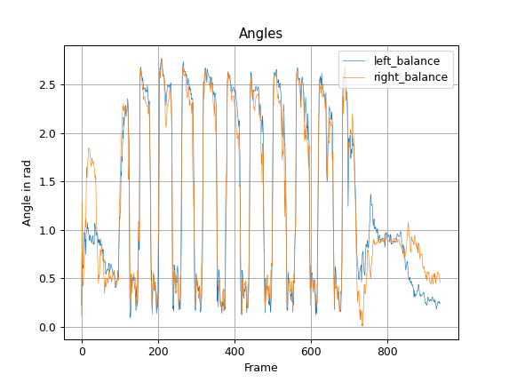

# Analyze Sports Activities

Fig. 1: Human Pose Detection. Adapted from Ivan Samkov, www.pixels.com

Various gymnastic exercises are recognized, classified and analyzed via video.

## Motivation
If you exercise regularly, it is desirable to have a recording of your activities. This gives you an overview of the intensity of the workouts and development of your fitness over the weeks and months. Therefore, tracking tools for running, cycling, etc. are very popular. Unfortunately, for many kinds of sports (weight training, gymnastics, etc.) there is no automatic recording option.

## Solution
Activities are recorded by a camera and analyzed by various methods. The Algorithms detect the type of exercise (squat, jump, pull-up, ...) and count the number of repetitions. This is done by applying the body pose tracking algorithm from [MediaPipe](https://google.github.io/mediapipe/solutions/pose.html). The identified landmarks (Fig. 1) are used for identifying the type of exercise, measuring the speed of an exercies und count the number of repetitions.
Unfortunately there is not much data available to train the system. Therefore a simple learning strategy is used. For each exercise one video with several repetitions of this exercise is provided together with a very limited number of required labels. 

# Learning
## Input data
These labels are the name of the exercise as well as the start and end time of the exercises within the video is manual added. Fig. 2 shows the parameters and labels for 5 different exercises (mp4-files) to be learned. 

Fig. 2: Data provided for the learning phase

All you have to do to train the algorithm ist to record a video file for each exercice. It schould have a high quality (lighting, visibility of the person and all body parts during the complete exercise) and a reasonable number of repetitions. I did 10 doing as even movements as possible. As shown in Fig. 2 you have to tell the program what the name of the exercise is and roughly what frame it starts and ends with. Thats all. The algorithm will figure out how many repetitions it is.    
Note that it is always possible to add further exercises. The learning algorthim will generate a modell for the new activity and will recognize it furtheron.

## Learning: Algorithm
MediaPipe provides the 3D coordinates of body landmarks. Since we are interessted in the movement of body parts, we convert the landmarks in angles between body parts. This makes us independent of the person's size and position relative to the camera. From the 33 landmarks we derive 23 angles. This is a first best guess choice and is probably suboptimal, see Fig. 3.

Fig. 3: Landmarks from Mediapipe and Angles.

Anges are always defined as angle between two lines. The lines are defined by two landmarks. E.g. the angle of **head_rotation** is defined as the angle between the line connection left and right ear (7 - 8) and the line connection left and right shoulder (11 - 12). In Fig. 3 the definition of each of the 23 angles is given by 4 landmarks.

....

Fig. 4: Example: left_balance in a 3d presentation.

The angles are calculated for each frame. The time sequence of a squat exercise is shown in Fig. 5. The left and right balance showns a periodic behavior from about frame 100 to 700. In this time sequence both graphs are highly correlated. This is expected since both legs are bent in parallel. 

Fig. 5: Graph of left and right balance over frame number.

As seen in Fig. 5 the correlation of both graphs and the periodic behaviour is not present in the video frames before start (#frame<100) and after end (#frame>700) of the exercise. Also the amplitude is much smaller because the hips don't move that much.

## Derivation of a Model
The models of individual exercises are derived one by one and added to a file containing all learned models.
1. Identify the angles with the highest amplitude
2. Determine the frequency of the periode (that might change over time).
3. Compare the frequency of different angles and choose those that are very similar (The remaining angles form a fingerprint to identify the exercise).
4. Add the new learned exercise to the json file containing all previously learned models

# Evaluation
## Analyzing a video
Once the exercises are learned, exercises can be can be evaluated during training by analysing the videos.

To evaluate a sports video many of the algorithmic steps are equivalent to that during learning. Except that the derived parameters are compared to these strored in the leaned models. Here the first steps of the analysis process are similar.

1. Identify the angles with the highest amplitude
2. Determine the frequency of the periode (that might change over time).
3. Compare the frequency of different angles and choose those that are very similar (The remaining angles form a fingerprint to identify the exercise).
4. Select the activity from the models json file that matches it the best.
For further detailed analysis of the exercise, the timing of the frames is adjusted to get a constant frequency of the exercise (angles).
5. Compute the frequnecy as a functuion over frames (=time).
6. Time-warping: Adjust the number of frames to get a constant lenght of all periods.
7. Find the exact number of repetitions: Average the angle over all periods and convolve it with the complete time sequence. The peaks in the resulting signal are rated against a threshold. The result gives the number of repetitions.
8. As a final step, statistics can be generated. Here a line is added to a report, as shown in Fig. 6.

Fig. 6: Final result: Overview and details of activities.

The algorithms extract characteristic features of that exercise 

## Conclusion
At the moment the system is in a prototype phase. A lot of improvements and code cleanups are necessary. Hence, code together with a more detailled description will be provided later.
